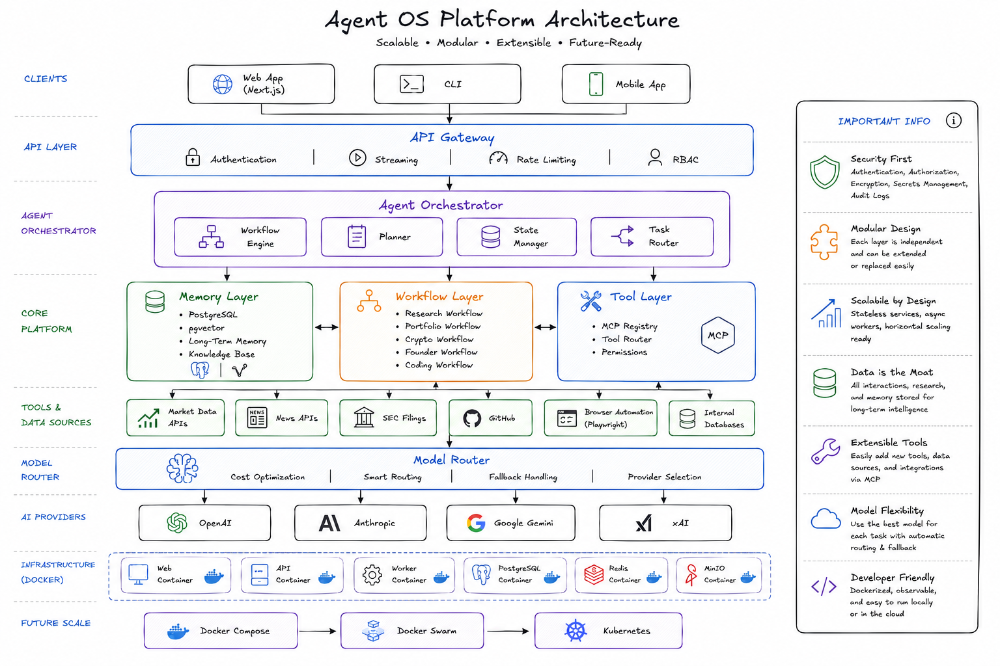

# Agent 

A production-grade Agent Operating System — modular, scalable, and extensible. Supports multiple domains (Investment OS, Crypto OS, Founder OS, Developer OS) on a shared platform architecture.



---

## Goals

Build a long-term AI platform, not a chatbot. The system supports:

- AI agents
- Workflows
- Long-term memory
- Plugin-based tools
- Multi-model routing
- Background jobs
- Future autonomous automation

The architecture remains stable as new domains are added.

---

## Tech Stack

| Layer | Technology |
|---|---|
| Frontend | Next.js, TypeScript, Tailwind CSS, shadcn/ui |
| Backend | Node.js, TypeScript, Fastify |
| Database | PostgreSQL, pgvector |
| Cache / Queue | Redis |
| Agent Runtime | LangGraph |
| Containerization | Docker, Docker Compose |
| Future | Docker Swarm, Kubernetes |

---

## Architecture

### Modular Monolith

Each domain is isolated into its own module. Modules can later be extracted into services.

```
modules/
├── investment
├── crypto
├── founder
└── coding
```

### Provider-Agnostic AI Layer

All providers implement a common interface. The rest of the system never depends on a specific provider.

```ts
interface AIProvider {
  generate(request): Promise<Response>
}
```

Implementations: OpenAI, Anthropic, Gemini, xAI

### Smart Model Router

Routes requests to the optimal provider based on task type, latency, and cost.

| Task | Provider |
|---|---|
| Coding | OpenAI |
| Research | Anthropic |
| Cheap tasks | Gemini |
| Real-time | xAI |

### Agent Orchestrator

Central component that coordinates execution across the platform.

- **Planner** — decomposes goals into tasks
- **Workflow Engine** — executes LangGraph workflows
- **State Manager** — manages agent and workflow state
- **Task Router** — routes tasks to the right agent or tool

### Memory System

Long-term memory backed by PostgreSQL + pgvector.

Memory types: conversations, research, investment theses, decisions, notes, knowledge

Features: semantic search, retrieval, memory updates

### Workflow Engine (LangGraph)

Supports branching, retries, checkpoints, human approval, and parallel execution.

Example workflows: Research, Portfolio, Crypto, Coding

### Tool System

Plugin architecture for extending agent capabilities.

```ts
interface Tool {
  execute(input): Promise<Output>
}
```

Built-in tools: Browser, GitHub, PostgreSQL, Market Data, News, SEC Filings, Filesystem

MCP support included.

### Background Jobs

Worker service driven by a Redis queue.

Responsibilities: research scans, portfolio updates, alerts, summarization

---

## Domains

### Investment OS (First Domain)

| Entities | Features |
|---|---|
| Portfolio, Watchlist, Positions, Transactions | Stock analysis |
| Research, Earnings, Alerts | Investment thesis tracking |
| | Watchlist monitoring, Earnings summaries, Catalyst tracking |

---

## API

Fastify API with auth, streaming, rate limiting, and RBAC.

```
POST /chat
GET  /workflows
GET  /memory
GET  /tools
GET  /portfolio
GET  /watchlist
```

---

## Frontend

Next.js dashboard with pages: Chat, Portfolio, Research, Watchlist, Workflows, Memory, Settings

---

## CLI

```bash
agent chat
agent research TSLA
agent portfolio
agent memory search
agent workflow run
```

CLI and Web share the same backend.

---

## Infrastructure

Docker Compose setup with five containers:

```
web       → Next.js frontend
api       → Fastify backend
worker    → Background job processor
postgres  → PostgreSQL + pgvector
redis     → Cache and job queue
```

Configuration: `docker-compose.yml`, `Dockerfiles`, `.env.example`

---

## Observability

- Structured logging and distributed tracing
- Token usage and model cost tracking
- Workflow and tool execution metrics
- Audit logs

---

## Deliverables

1. Complete architecture
2. Folder structure
3. Database schema
4. TypeScript interfaces
5. Docker setup
6. LangGraph workflows
7. API design
8. Frontend architecture
9. CLI architecture
10. Step-by-step implementation plan
